# Object Detection in an Urban Environment 2.0

In this project, you will learn how to train an object detection model using the [Tensorflow Object Detection API](https://tensorflow-object-detection-api-tutorial.readthedocs.io/en/latest/index.html) and [AWS Sagemaker](https://aws.amazon.com/sagemaker/).

This link has the former documentation: [FORMER_README.md](FORMER_README.md)

In this current documentation, we will focus on the rubric.

# RUBRIC:

You can click on the [rubric for the project Object Detection in an Urban Environment 2.0](https://review.udacity.com/#!/rubrics/5089/view).

## [Model training and Evaluation]

## 1. Test at least two pretrained models (other than EfficientNet)

> * Tried two models other than EfficientNet.
> * Update and submit the `pipeline.config` file and notebooks associated with all the pretrained models.

I tried 2 models other than EfficientNet:
1. SSD MobileNet V2 FPNLite 640x640 [[Pretrained Model](http://download.tensorflow.org/models/object_detection/tf2/20200711/ssd_mobilenet_v2_fpnlite_640x640_coco17_tpu-8.tar.gz)] [[Jupyter Notebook](1_model_training_SSD_MobileNet/1_train_model_SSD_MobileNet.ipynb)] [[pipeline.config](1_model_training_SSD_MobileNet/source_dir/pipeline.config)] [[Training Directory](1_model_training_SSD_MobileNet/)]
2. SSD ResNet50 V1 FPN 640x640 (RetinaNet50) [[Pretrained Model](http://download.tensorflow.org/models/object_detection/tf2/20200711/ssd_resnet50_v1_fpn_640x640_coco17_tpu-8.tar.gz)] [[Jupyter Notebook](1_model_training_RetinaNet50/1_train_model_RetinaNet50.ipynb)] [[pipeline.config](1_model_training_RetinaNet50/source_dir/pipeline.config)] [[Training Directory](1_model_training_RetinaNet50/)]

Helpful links:
- [Training and deploying models using TensorFlow 2 with the Object Detection API on Amazon SageMaker](https://aws.amazon.com/blogs/machine-learning/training-and-deploying-models-using-tensorflow-2-with-the-object-detection-api-on-amazon-sagemaker/)
- [TensorFlow 2 Detection Model Zoo](https://github.com/tensorflow/models/blob/master/research/object_detection/g3doc/tf2_detection_zoo.md)
- [Configuration Files of the Detection Models](https://github.com/tensorflow/models/tree/master/research/object_detection/configs/tf2)
- [Object Detection in an Urban Environment](https://learn.udacity.com/paid-courses/cd2688)

## 2. Choosing the best model for deployment

> Write a brief summary of your experiments and suggest the best model for this problem. This should include the accuracy (mAP) values of the models you tried. Also, discuss the following:
> 
> * How does the validation loss compare to the training loss?
> * Did you expect such behavior from the losses/metrics?
> * What can you do to improve the performance of the tested models further?

> [INSTRUCTIONS FROM THE JUPYTER NOTEBOOK]<br/>
> **Improve on the initial model**
> 
> Most likely, this initial experiment did not yield optimal results. However, you can make multiple changes to the pipeline.config file to improve this model. One obvious change consists in improving the data augmentation strategy. The preprocessor.proto file contains the different data augmentation method available in the Tf Object Detection API. Justify your choices of augmentations in the writeup.
> 
> Keep in mind that the following are also available:
> 
> * experiment with the optimizer: type of optimizer, learning rate, scheduler etc
> * experiment with the architecture. The Tf Object Detection API model zoo offers many architectures. Keep in mind that the pipeline.config file is unique for each architecture and you will have to edit it.
> * visualize results on the test frames using the `2_deploy_model` notebook available in this repository.
> 
> In the cell below, write down all the different approaches you have experimented with, why you have chosen them and what you would have done if you had more time and resources. Justify your choices using the tensorboard visualizations (take screenshots and insert them in your writeup), the metrics on the evaluation set and the generated animation you have created with this tool.

### AWS Costs

First off, I spent US$216 in Amazon Web Services when I was searching for the best models possible.
So, please consider this factor when grading the rubric.

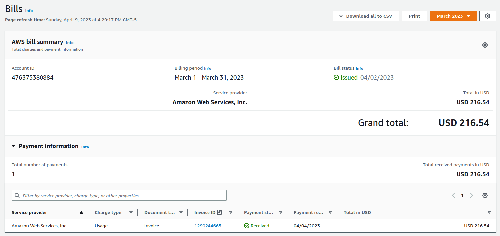

### Baseline Experiment - EfficientDet D1 640x640

[[Jupyter Notebook](1_model_training/1_train_model.ipynb)]
[[pipeline.config](1_model_training/source_dir/pipeline.config)]

```
I0323 02:05:31.501080 140013260003136 model_lib_v2.py:1015] Eval metrics at step 2000
INFO:tensorflow:#011+ DetectionBoxes_Precision/mAP: 0.079465
I0323 02:05:31.514246 140013260003136 model_lib_v2.py:1018] #011+ DetectionBoxes_Precision/mAP: 0.079465
INFO:tensorflow:#011+ DetectionBoxes_Precision/mAP@.50IOU: 0.199936
I0323 02:05:31.515697 140013260003136 model_lib_v2.py:1018] #011+ DetectionBoxes_Precision/mAP@.50IOU: 0.199936
INFO:tensorflow:#011+ DetectionBoxes_Precision/mAP@.75IOU: 0.048818
I0323 02:05:31.517093 140013260003136 model_lib_v2.py:1018] #011+ DetectionBoxes_Precision/mAP@.75IOU: 0.048818
INFO:tensorflow:#011+ DetectionBoxes_Precision/mAP (small): 0.034636
I0323 02:05:31.518450 140013260003136 model_lib_v2.py:1018] #011+ DetectionBoxes_Precision/mAP (small): 0.034636
INFO:tensorflow:#011+ DetectionBoxes_Precision/mAP (medium): 0.309154
I0323 02:05:31.519841 140013260003136 model_lib_v2.py:1018] #011+ DetectionBoxes_Precision/mAP (medium): 0.309154
INFO:tensorflow:#011+ DetectionBoxes_Precision/mAP (large): 0.241418
I0323 02:05:31.521204 140013260003136 model_lib_v2.py:1018] #011+ DetectionBoxes_Precision/mAP (large): 0.241418
INFO:tensorflow:#011+ DetectionBoxes_Recall/AR@1: 0.020105
I0323 02:05:31.522563 140013260003136 model_lib_v2.py:1018] #011+ DetectionBoxes_Recall/AR@1: 0.020105
INFO:tensorflow:#011+ DetectionBoxes_Recall/AR@10: 0.090442
I0323 02:05:31.524003 140013260003136 model_lib_v2.py:1018] #011+ DetectionBoxes_Recall/AR@10: 0.090442
INFO:tensorflow:#011+ DetectionBoxes_Recall/AR@100: 0.126141
I0323 02:05:31.525356 140013260003136 model_lib_v2.py:1018] #011+ DetectionBoxes_Recall/AR@100: 0.126141
INFO:tensorflow:#011+ DetectionBoxes_Recall/AR@100 (small): 0.068426
I0323 02:05:31.526715 140013260003136 model_lib_v2.py:1018] #011+ DetectionBoxes_Recall/AR@100 (small): 0.068426
INFO:tensorflow:#011+ DetectionBoxes_Recall/AR@100 (medium): 0.441800
I0323 02:05:31.528115 140013260003136 model_lib_v2.py:1018] #011+ DetectionBoxes_Recall/AR@100 (medium): 0.441800
INFO:tensorflow:#011+ DetectionBoxes_Recall/AR@100 (large): 0.344867
I0323 02:05:31.529497 140013260003136 model_lib_v2.py:1018] #011+ DetectionBoxes_Recall/AR@100 (large): 0.344867
INFO:tensorflow:#011+ Loss/localization_loss: 0.024434
I0323 02:05:31.530541 140013260003136 model_lib_v2.py:1018] #011+ Loss/localization_loss: 0.024434
INFO:tensorflow:#011+ Loss/classification_loss: 0.441609
I0323 02:05:31.531654 140013260003136 model_lib_v2.py:1018] #011+ Loss/classification_loss: 0.441609
INFO:tensorflow:#011+ Loss/regularization_loss: 0.030694
I0323 02:05:31.532732 140013260003136 model_lib_v2.py:1018] #011+ Loss/regularization_loss: 0.030694
INFO:tensorflow:#011+ Loss/total_loss: 0.496737
I0323 02:05:31.533815 140013260003136 model_lib_v2.py:1018] #011+ Loss/total_loss: 0.496737
```

```
 Average Precision  (AP) @[ IoU=0.50:0.95 | area=   all | maxDets=100 ] = 0.079
 Average Precision  (AP) @[ IoU=0.50      | area=   all | maxDets=100 ] = 0.200
 Average Precision  (AP) @[ IoU=0.75      | area=   all | maxDets=100 ] = 0.049
 Average Precision  (AP) @[ IoU=0.50:0.95 | area= small | maxDets=100 ] = 0.035
 Average Precision  (AP) @[ IoU=0.50:0.95 | area=medium | maxDets=100 ] = 0.309
 Average Precision  (AP) @[ IoU=0.50:0.95 | area= large | maxDets=100 ] = 0.241
 Average Recall     (AR) @[ IoU=0.50:0.95 | area=   all | maxDets=  1 ] = 0.020
 Average Recall     (AR) @[ IoU=0.50:0.95 | area=   all | maxDets= 10 ] = 0.090
 Average Recall     (AR) @[ IoU=0.50:0.95 | area=   all | maxDets=100 ] = 0.126
 Average Recall     (AR) @[ IoU=0.50:0.95 | area= small | maxDets=100 ] = 0.068
 Average Recall     (AR) @[ IoU=0.50:0.95 | area=medium | maxDets=100 ] = 0.442
 Average Recall     (AR) @[ IoU=0.50:0.95 | area= large | maxDets=100 ] = 0.345
```

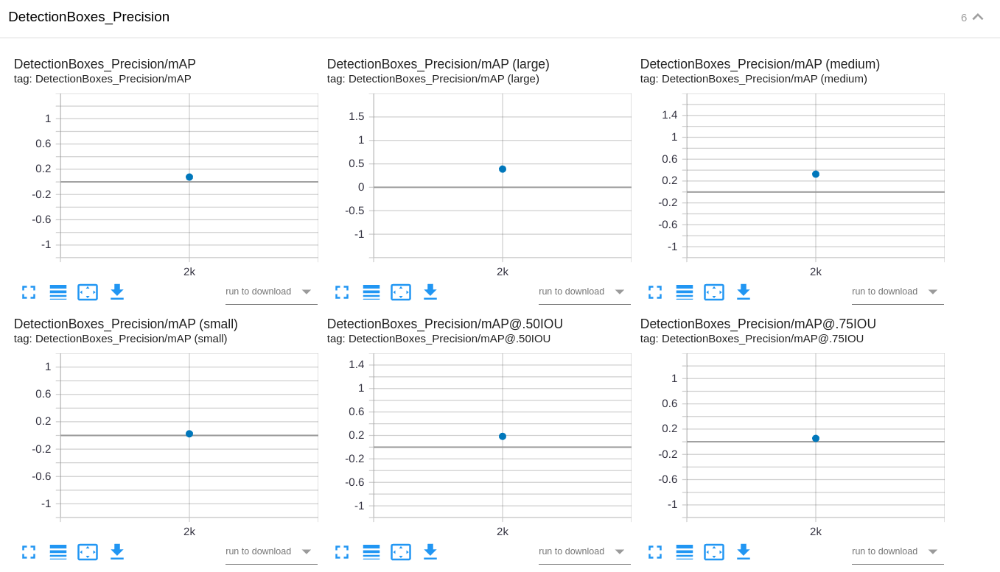

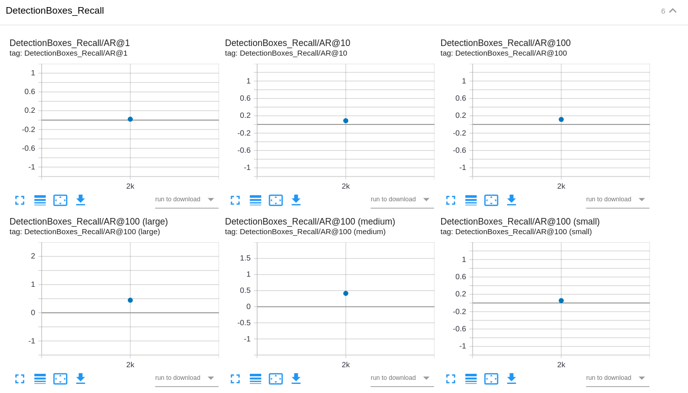

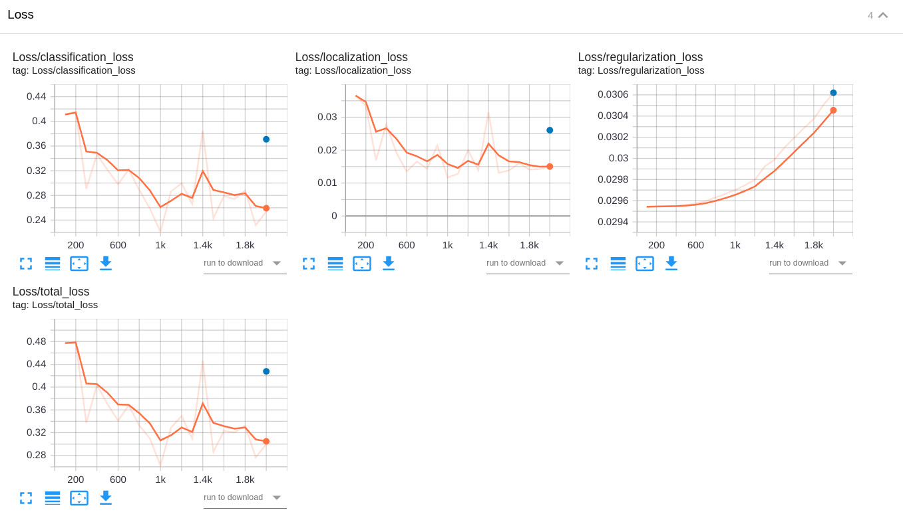

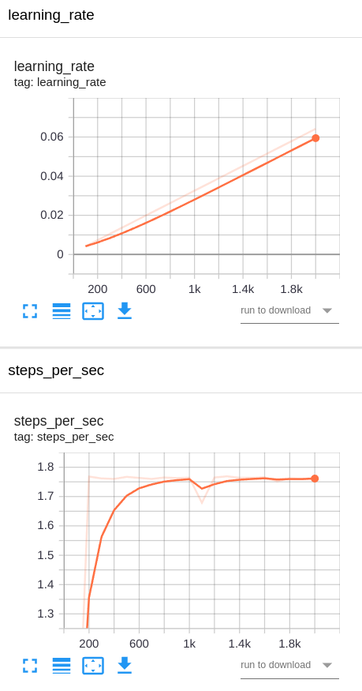


[Video file output.avi](2_run_inference/output.avi)

Jupyter Notebook [2_deploy_model.ipynb](2_run_inference/2_deploy_model.ipynb)

### Experiment 1 - SSD MobileNet V2 FPNLite 640x640

[[Jupyter Notebook](1_model_training_SSD_MobileNet/1_train_model_SSD_MobileNet.ipynb)]
[[pipeline.config](1_model_training_SSD_MobileNet/source_dir/pipeline.config)]

In the experiment 1, I used the pretrained model `SSD MobileNet V2 FPNLite 640x640`.

I used many data augmentation strategies:
- `random_horizontal_flip`
- `random_adjust_brightness`
- `random_adjust_contrast`
- `random_adjust_hue`
- `random_adjust_saturation`
- `random_image_scale`
- `random_rgb_to_gray`

I also changed `batch_size` to `8` and `num_steps` to `10000`.

I used the Adam optimizer with a `initial_learning_rate` of `0.0005`.
And I changed the learning rate to `0.0001` at step `2500`, `0.00005` at step `5000`, and `0.00001` at step `7500`.

```
train_config: {
  fine_tune_checkpoint_version: V2
  fine_tune_checkpoint: "checkpoint/ckpt-0"
  fine_tune_checkpoint_type: "detection"
  batch_size: 8
  sync_replicas: true
  startup_delay_steps: 0
  replicas_to_aggregate: 8
  num_steps: 10000
  data_augmentation_options {
    random_horizontal_flip {
      probability: 0.5
    }
  }
  data_augmentation_options {
    random_adjust_brightness {
      max_delta: 0.2
    }
  }
  data_augmentation_options {
    random_adjust_contrast {
      min_delta: 0.7
      max_delta: 1.1
    }
  }
  data_augmentation_options {
    random_adjust_hue {
      max_delta: 0.01
    }
  }
  data_augmentation_options {
    random_adjust_saturation {
      min_delta: 0.75
      max_delta: 1.15
    }
  }
  data_augmentation_options {
    random_image_scale {
      min_scale_ratio: 0.8
      max_scale_ratio: 2.2
    }
  }
  data_augmentation_options {
    random_rgb_to_gray {
      probability: 0.3
    }
  }
  optimizer {
    adam_optimizer: {
      learning_rate: {
        manual_step_learning_rate {
          initial_learning_rate: .0005
          schedule {
            step: 2500
            learning_rate: .0001
          }
          schedule {
            step: 5000
            learning_rate: .00005
          }
          schedule {
            step: 7500
            learning_rate: .00001
          }
        }
      }
    }
    use_moving_average: false
  }
  max_number_of_boxes: 100
  unpad_groundtruth_tensors: false
}
```

And by doing this, I improved some results:

```
INFO:tensorflow:Eval metrics at step 10000
I0328 06:47:53.264510 139632741836608 model_lib_v2.py:1015] Eval metrics at step 10000
INFO:tensorflow:#011+ DetectionBoxes_Precision/mAP: 0.127604
I0328 06:47:53.275685 139632741836608 model_lib_v2.py:1018] #011+ DetectionBoxes_Precision/mAP: 0.127604
INFO:tensorflow:#011+ DetectionBoxes_Precision/mAP@.50IOU: 0.262165
I0328 06:47:53.277360 139632741836608 model_lib_v2.py:1018] #011+ DetectionBoxes_Precision/mAP@.50IOU: 0.262165
INFO:tensorflow:#011+ DetectionBoxes_Precision/mAP@.75IOU: 0.109342
I0328 06:47:53.278857 139632741836608 model_lib_v2.py:1018] #011+ DetectionBoxes_Precision/mAP@.75IOU: 0.109342
INFO:tensorflow:#011+ DetectionBoxes_Precision/mAP (small): 0.053764
I0328 06:47:53.280415 139632741836608 model_lib_v2.py:1018] #011+ DetectionBoxes_Precision/mAP (small): 0.053764
INFO:tensorflow:#011+ DetectionBoxes_Precision/mAP (medium): 0.435959
I0328 06:47:53.281942 139632741836608 model_lib_v2.py:1018] #011+ DetectionBoxes_Precision/mAP (medium): 0.435959
INFO:tensorflow:#011+ DetectionBoxes_Precision/mAP (large): 0.556335
I0328 06:47:53.283474 139632741836608 model_lib_v2.py:1018] #011+ DetectionBoxes_Precision/mAP (large): 0.556335
INFO:tensorflow:#011+ DetectionBoxes_Recall/AR@1: 0.028387
I0328 06:47:53.285100 139632741836608 model_lib_v2.py:1018] #011+ DetectionBoxes_Recall/AR@1: 0.028387
INFO:tensorflow:#011+ DetectionBoxes_Recall/AR@10: 0.129599
I0328 06:47:53.286616 139632741836608 model_lib_v2.py:1018] #011+ DetectionBoxes_Recall/AR@10: 0.129599
INFO:tensorflow:#011+ DetectionBoxes_Recall/AR@100: 0.183234
I0328 06:47:53.288196 139632741836608 model_lib_v2.py:1018] #011+ DetectionBoxes_Recall/AR@100: 0.183234
INFO:tensorflow:#011+ DetectionBoxes_Recall/AR@100 (small): 0.117098
I0328 06:47:53.289684 139632741836608 model_lib_v2.py:1018] #011+ DetectionBoxes_Recall/AR@100 (small): 0.117098
INFO:tensorflow:#011+ DetectionBoxes_Recall/AR@100 (medium): 0.515716
I0328 06:47:53.291176 139632741836608 model_lib_v2.py:1018] #011+ DetectionBoxes_Recall/AR@100 (medium): 0.515716
INFO:tensorflow:#011+ DetectionBoxes_Recall/AR@100 (large): 0.651331
I0328 06:47:53.292778 139632741836608 model_lib_v2.py:1018] #011+ DetectionBoxes_Recall/AR@100 (large): 0.651331
INFO:tensorflow:#011+ Loss/localization_loss: 0.418279
I0328 06:47:53.293933 139632741836608 model_lib_v2.py:1018] #011+ Loss/localization_loss: 0.418279
INFO:tensorflow:#011+ Loss/classification_loss: 0.305893
I0328 06:47:53.295172 139632741836608 model_lib_v2.py:1018] #011+ Loss/classification_loss: 0.305893
INFO:tensorflow:#011+ Loss/regularization_loss: 0.116482
I0328 06:47:53.296380 139632741836608 model_lib_v2.py:1018] #011+ Loss/regularization_loss: 0.116482
INFO:tensorflow:#011+ Loss/total_loss: 0.840655
I0328 06:47:53.297557 139632741836608 model_lib_v2.py:1018] #011+ Loss/total_loss: 0.840655
```

```
 Average Precision  (AP) @[ IoU=0.50:0.95 | area=   all | maxDets=100 ] = 0.128
 Average Precision  (AP) @[ IoU=0.50      | area=   all | maxDets=100 ] = 0.262
 Average Precision  (AP) @[ IoU=0.75      | area=   all | maxDets=100 ] = 0.109
 Average Precision  (AP) @[ IoU=0.50:0.95 | area= small | maxDets=100 ] = 0.054
 Average Precision  (AP) @[ IoU=0.50:0.95 | area=medium | maxDets=100 ] = 0.436
 Average Precision  (AP) @[ IoU=0.50:0.95 | area= large | maxDets=100 ] = 0.556
 Average Recall     (AR) @[ IoU=0.50:0.95 | area=   all | maxDets=  1 ] = 0.028
 Average Recall     (AR) @[ IoU=0.50:0.95 | area=   all | maxDets= 10 ] = 0.130
 Average Recall     (AR) @[ IoU=0.50:0.95 | area=   all | maxDets=100 ] = 0.183
 Average Recall     (AR) @[ IoU=0.50:0.95 | area= small | maxDets=100 ] = 0.117
 Average Recall     (AR) @[ IoU=0.50:0.95 | area=medium | maxDets=100 ] = 0.516
 Average Recall     (AR) @[ IoU=0.50:0.95 | area= large | maxDets=100 ] = 0.651
```

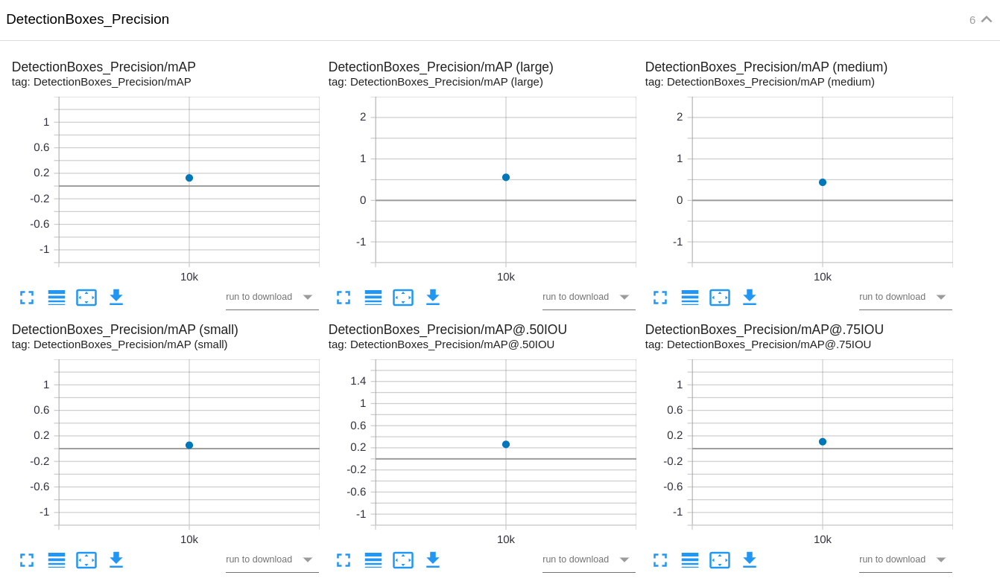

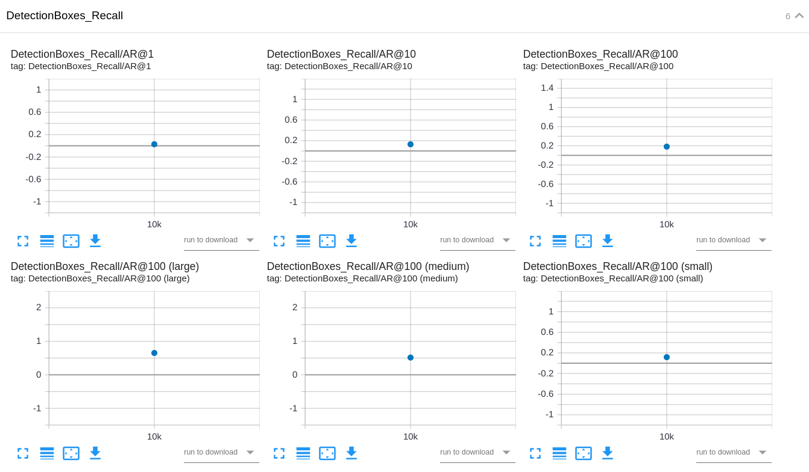

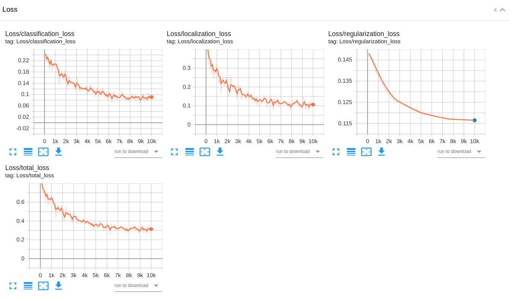

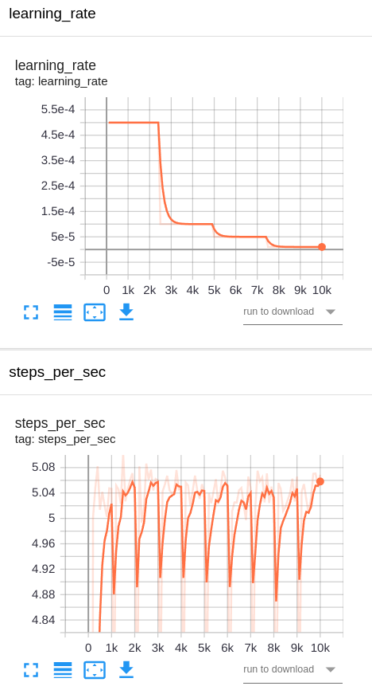


[Video file output.avi](2_run_inference_SSD_MobileNet/output.avi)

Jupyter Notebook [2_deploy_model_SSD_MobileNet.ipynb](2_run_inference_SSD_MobileNet/2_deploy_model_SSD_MobileNet.ipynb)

### Experiment 2 - SSD ResNet50 V1 FPN 640x640 (RetinaNet50)

[[Jupyter Notebook](1_model_training_RetinaNet50/1_train_model_RetinaNet50.ipynb)]
[[pipeline.config](1_model_training_RetinaNet50/source_dir/pipeline.config)]

In the experiment 1, I used the pretrained model `SSD ResNet50 V1 FPN 640x640 (RetinaNet50)`.

I used many data augmentation strategies:
- `random_horizontal_flip`
- `random_adjust_brightness`
- `random_adjust_contrast`
- `random_adjust_hue`
- `random_adjust_saturation`
- `random_image_scale`
- `random_rgb_to_gray`

I also changed `batch_size` to `8` and `num_steps` to `10000`.

I used the Adam optimizer with a `initial_learning_rate` of `0.0005`.
And I changed the learning rate to `0.0001` at step `2500`, `0.00005` at step `5000`, and `0.00001` at step `7500`.

```
train_config: {
  fine_tune_checkpoint_version: V2
  fine_tune_checkpoint: "checkpoint/ckpt-0"
  fine_tune_checkpoint_type: "detection"
  batch_size: 8
  sync_replicas: true
  startup_delay_steps: 0
  replicas_to_aggregate: 8
  use_bfloat16: true
  num_steps: 10000
  data_augmentation_options {
    random_horizontal_flip {
      probability: 0.5
    }
  }
  data_augmentation_options {
    random_adjust_brightness {
      max_delta: 0.2
    }
  }
  data_augmentation_options {
    random_adjust_contrast {
      min_delta: 0.7
      max_delta: 1.1
    }
  }
  data_augmentation_options {
    random_adjust_hue {
      max_delta: 0.01
    }
  }
  data_augmentation_options {
    random_adjust_saturation {
      min_delta: 0.75
      max_delta: 1.15
    }
  }
  data_augmentation_options {
    random_image_scale {
      min_scale_ratio: 0.8
      max_scale_ratio: 2.2
    }
  }
  data_augmentation_options {
    random_rgb_to_gray {
      probability: 0.3
    }
  }
  optimizer {
    adam_optimizer: {
      learning_rate: {
        manual_step_learning_rate {
          initial_learning_rate: .0005
          schedule {
            step: 2500
            learning_rate: .0001
          }
          schedule {
            step: 5000
            learning_rate: .00005
          }
          schedule {
            step: 7500
            learning_rate: .00001
          }
        }
      }
    }
    use_moving_average: false
  }
  max_number_of_boxes: 100
  unpad_groundtruth_tensors: false
}
```

And by doing this, I improved some results:

```
INFO:tensorflow:Eval metrics at step 10000
I0328 03:26:05.216826 139873701160768 model_lib_v2.py:1015] Eval metrics at step 10000
INFO:tensorflow:#011+ DetectionBoxes_Precision/mAP: 0.137720
I0328 03:26:05.228162 139873701160768 model_lib_v2.py:1018] #011+ DetectionBoxes_Precision/mAP: 0.137720
INFO:tensorflow:#011+ DetectionBoxes_Precision/mAP@.50IOU: 0.265962
I0328 03:26:05.229598 139873701160768 model_lib_v2.py:1018] #011+ DetectionBoxes_Precision/mAP@.50IOU: 0.265962
INFO:tensorflow:#011+ DetectionBoxes_Precision/mAP@.75IOU: 0.124488
I0328 03:26:05.231010 139873701160768 model_lib_v2.py:1018] #011+ DetectionBoxes_Precision/mAP@.75IOU: 0.124488
INFO:tensorflow:#011+ DetectionBoxes_Precision/mAP (small): 0.057460
I0328 03:26:05.232390 139873701160768 model_lib_v2.py:1018] #011+ DetectionBoxes_Precision/mAP (small): 0.057460
INFO:tensorflow:#011+ DetectionBoxes_Precision/mAP (medium): 0.479444
I0328 03:26:05.233793 139873701160768 model_lib_v2.py:1018] #011+ DetectionBoxes_Precision/mAP (medium): 0.479444
INFO:tensorflow:#011+ DetectionBoxes_Precision/mAP (large): 0.554146
I0328 03:26:05.235203 139873701160768 model_lib_v2.py:1018] #011+ DetectionBoxes_Precision/mAP (large): 0.554146
INFO:tensorflow:#011+ DetectionBoxes_Recall/AR@1: 0.029238
I0328 03:26:05.236585 139873701160768 model_lib_v2.py:1018] #011+ DetectionBoxes_Recall/AR@1: 0.029238
INFO:tensorflow:#011+ DetectionBoxes_Recall/AR@10: 0.135522
I0328 03:26:05.237928 139873701160768 model_lib_v2.py:1018] #011+ DetectionBoxes_Recall/AR@10: 0.135522
INFO:tensorflow:#011+ DetectionBoxes_Recall/AR@100: 0.195034
I0328 03:26:05.239308 139873701160768 model_lib_v2.py:1018] #011+ DetectionBoxes_Recall/AR@100: 0.195034
INFO:tensorflow:#011+ DetectionBoxes_Recall/AR@100 (small): 0.126034
I0328 03:26:05.240660 139873701160768 model_lib_v2.py:1018] #011+ DetectionBoxes_Recall/AR@100 (small): 0.126034
INFO:tensorflow:#011+ DetectionBoxes_Recall/AR@100 (medium): 0.543198
I0328 03:26:05.242003 139873701160768 model_lib_v2.py:1018] #011+ DetectionBoxes_Recall/AR@100 (medium): 0.543198
INFO:tensorflow:#011+ DetectionBoxes_Recall/AR@100 (large): 0.708365
I0328 03:26:05.243425 139873701160768 model_lib_v2.py:1018] #011+ DetectionBoxes_Recall/AR@100 (large): 0.708365
INFO:tensorflow:#011+ Loss/localization_loss: 0.358813
I0328 03:26:05.244471 139873701160768 model_lib_v2.py:1018] #011+ Loss/localization_loss: 0.358813
INFO:tensorflow:#011+ Loss/classification_loss: 0.397361
I0328 03:26:05.245524 139873701160768 model_lib_v2.py:1018] #011+ Loss/classification_loss: 0.397361
INFO:tensorflow:#011+ Loss/regularization_loss: 0.122182
I0328 03:26:05.246578 139873701160768 model_lib_v2.py:1018] #011+ Loss/regularization_loss: 0.122182
INFO:tensorflow:#011+ Loss/total_loss: 0.878356
I0328 03:26:05.247700 139873701160768 model_lib_v2.py:1018] #011+ Loss/total_loss: 0.878356
```

```
 Average Precision  (AP) @[ IoU=0.50:0.95 | area=   all | maxDets=100 ] = 0.138
 Average Precision  (AP) @[ IoU=0.50      | area=   all | maxDets=100 ] = 0.266
 Average Precision  (AP) @[ IoU=0.75      | area=   all | maxDets=100 ] = 0.124
 Average Precision  (AP) @[ IoU=0.50:0.95 | area= small | maxDets=100 ] = 0.057
 Average Precision  (AP) @[ IoU=0.50:0.95 | area=medium | maxDets=100 ] = 0.479
 Average Precision  (AP) @[ IoU=0.50:0.95 | area= large | maxDets=100 ] = 0.554
 Average Recall     (AR) @[ IoU=0.50:0.95 | area=   all | maxDets=  1 ] = 0.029
 Average Recall     (AR) @[ IoU=0.50:0.95 | area=   all | maxDets= 10 ] = 0.136
 Average Recall     (AR) @[ IoU=0.50:0.95 | area=   all | maxDets=100 ] = 0.195
 Average Recall     (AR) @[ IoU=0.50:0.95 | area= small | maxDets=100 ] = 0.126
 Average Recall     (AR) @[ IoU=0.50:0.95 | area=medium | maxDets=100 ] = 0.543
 Average Recall     (AR) @[ IoU=0.50:0.95 | area= large | maxDets=100 ] = 0.708
```

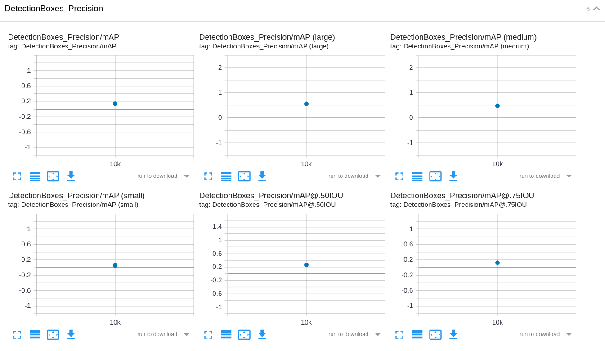

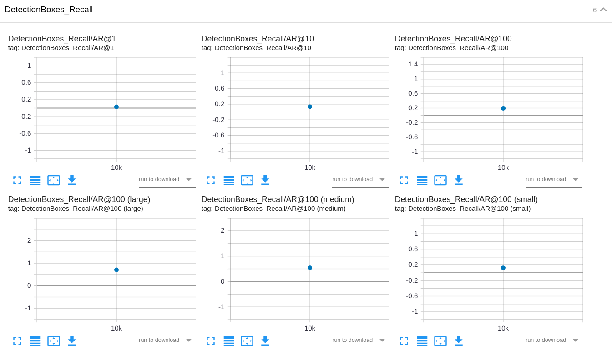

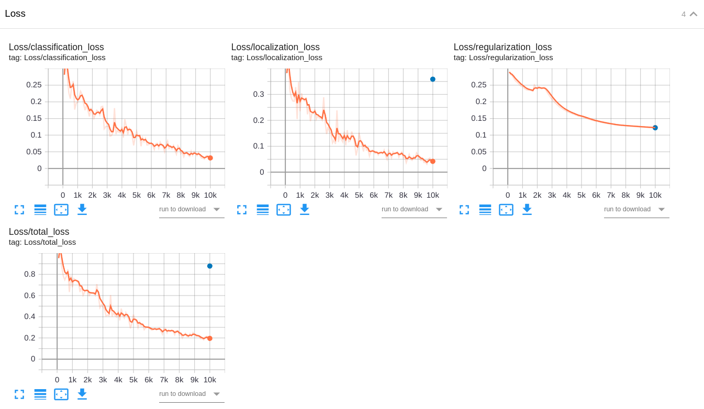

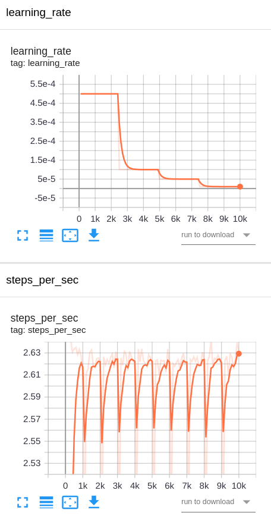


[Video file output.avi](2_run_inference_RetinaNet50/output.avi)

Jupyter Notebook [2_deploy_model_RetinaNet50.ipynb](2_run_inference_RetinaNet50/2_deploy_model_RetinaNet50.ipynb)

### Questions

#### How does the validation loss compare to the training loss?


#### Did you expect such behavior from the losses/metrics?

#### What can you do to improve the performance of the tested models further?


### Model Selection

This is how Udacity GPT defines AP, AR, and mAP:

> In the context of object detection, AP and AR are two important metrics used to evaluate the performance of object detection models.
> 
> AP stands for Average Precision, and it is a measure of how well the model is able to detect objects in an image. AP is calculated by computing the precision and recall values for each predicted object, and then taking the average of the precision values at different recall levels.
> 
> AR stands for Average Recall, and it is a measure of how well the model is able to detect all objects in an image. AR is calculated by computing the precision and recall values for each ground truth object, and then taking the average of the recall values at different precision levels.
> 
> Both AP and AR are important metrics for evaluating object detection models. AP measures how well the model is able to detect objects, while AR measures how well the model is able to detect all objects in an image.
> 
> It's important to note that AP and AR are related but not the same. A model with high AP may not necessarily have high AR, and vice versa.
> 
> To calculate mAP, we first calculate the precision and recall values for each predicted object. Then, we plot a precision-recall curve and calculate the area under the curve (AUC). This area gives us the mAP value.
> 
> The range of values for the mean average precision (mAP) is between 0 and 1. A value of 0 means that the model did not detect any objects correctly, while a value of 1 means that the model detected all objects correctly.


When comparing the values of mAP, AP, AR, and Loss in the validation dataset,
I obtained the following results by each model: 1st, 2nd, and 3rd places.
I also compared the videos of each model.

| Model                                                                  | mAP  | AP  | AR  | Loss | Video |
| ---------------------------------------------------------------------- | ---- | --- | --- | ---- | ----- |
| [EfficientDet D1](#baseline-experiment---efficientdet-d1-640x640)      | 3rd  | 3rd | 3rd | 1st  | 2nd   |
| [MobileNet V2](#experiment-1---ssd-mobilenet-v2-fpnlite-640x640)       | 2nd  | 2nd | 2nd | 2nd  | 3rd   |
| [RetinaNet50](#experiment-2---ssd-resnet50-v1-fpn-640x640-retinanet50) | 1st  | 1st | 1st | 3rd  | 1st   |

[RetinaNet50](#experiment-2---ssd-resnet50-v1-fpn-640x640-retinanet50) is the clear winner in almost all competitions,
except in the validation loss where it experienced overfitting and the winner was [EfficientDet D1](#baseline-experiment---efficientdet-d1-640x640).

Therefore, I selected [RetinaNet50](#experiment-2---ssd-resnet50-v1-fpn-640x640-retinanet50) for model deployment.


## [Model Deployment]

## 3. Deploy the best model and run inference.

> * Deploy the best model in AWS by completing and `running 2_deploy_model.ipynb`.
> * Should be able to generate an output video with vehicle, pedestrian, and cyclist detections using the deployed model.

I selected [RetinaNet50](#experiment-2---ssd-resnet50-v1-fpn-640x640-retinanet50) for model deployment.

And here is the Jupyter Notebook [2_deploy_model_RetinaNet50.ipynb](2_run_inference_RetinaNet50/2_deploy_model_RetinaNet50.ipynb)


[Video file output.avi](2_run_inference_RetinaNet50/output.avi)
